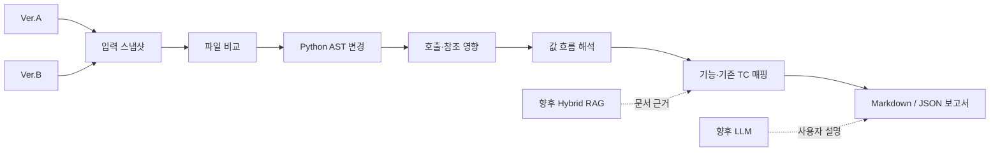

# QA Train

하나의 소스에서 AST를 생성하거나, Ver.A와 Ver.B의 로컬 코드·Git 버전·엔진 프로젝트·APK·IPA를 비교해 변경 지점과 QA 영향 후보를 찾는 정적 분석 프로젝트입니다.

현재는 **1차 MVP와 Streamlit Cloud 배포가 완료된 상태**입니다. `_AST`에서 단일 Python 소스의 트리형·정리형 보고서를 만들고, 비교 화면에서는 두 버전의 AST 변경·호출 관계·값 흐름을 분석합니다. 다음 개발 구간은 Hybrid RAG, LLM 해석, 다국어 분석입니다.

> 기준일: 2026-09-29
>
> 운영 형태: 로컬 실행 / [Streamlit Cloud](https://apptrain-akecrcbajuvarqhr2dgtcs.streamlit.app/)

## 프로젝트 목표

```text
Ver.A / Ver.B 입력
→ 비교 가능한 스냅샷으로 변환
→ 파일 및 코드 변경 탐지
→ 변경 심볼의 호출·참조·값 흐름 추적
→ 제품 기능과 기존 TC 연결
→ QA 영향 설명 및 회귀 테스트 후보 제시
```

분석 대상 코드는 실행하거나 import하지 않습니다. 결과는 변경 영향과 회귀 테스트의 **후보 및 근거**이며, 실제 제품의 Pass/Fail 판정은 아닙니다.

## 현재 진행도

| 영역 | 상태 | 현재 구현 |
|---|---|---|
| 입력 변환 | ✅ 완료 | 로컬 파일·폴더, Git ref, Unity·Unreal·Godot 프로젝트, APK, IPA를 스냅샷으로 준비 |
| 기본 파일 비교 | ✅ 완료 | 상대 경로·파일 크기·SHA-256 기준으로 추가·삭제·수정 탐지 |
| Git 버전 선택 | ✅ 완료 | 최근 커밋 목록에서 Ver.A·Ver.B 선택, 직전 커밋과 최신 커밋을 기본 선택 |
| Python AST 분석 | ✅ 완료 | 함수·클래스·import·호출·변수 대입·제어 흐름 추출 |
| 단일 입력 AST 화면 | ✅ 완료 | 맨 오른쪽 `_AST` 탭에서 단일 소스 분석, 데이터·설정 파일을 포함한 프로젝트 트리와 AST 보고서 다운로드 |
| 코드 영향 분석 | ✅ 완료 | 변경 심볼과 상위 호출·참조 관계 탐색 |
| 기능·TC 연결 | ✅ 완료 | 사용자가 제공한 기능 매핑 JSON으로 기능과 기존 TC 후보 연결 |
| 값 흐름 해석 | 🟡 1차 완료 | 반환값 → 변수 → 인자 → 매개변수 → 반환·상태 쓰기 후보 추적 |
| Streamlit UI | ✅ 완료 | Ver.A·Ver.B 준비, 비교, 흐름 해석, 결과 다운로드를 한 화면에서 처리 |
| AST/UI 역할 분리 | ✅ 완료 | `AST`는 분석 엔진, `streamlit`은 UI·웹 세션으로 독립 구성 |
| APK·IPA 분석 | 🟡 일부 지원 | 동일 형식끼리 파일 구성 비교, IPA `Info.plist` 메타데이터 확인 |
| Hybrid RAG | ⬜ 계획 | 코드 근거와 기능 명세·TC·프로젝트 문서를 함께 검색 |
| LLM 해석 | ⬜ 계획 | 검색 근거로 기능 영향과 QA 확인 항목을 설명 |
| 다국어 코드 분석 | ⬜ 계획 | JavaScript/TypeScript, Java/Kotlin, C#, C++용 파서·어댑터 |
| Streamlit Cloud 배포 | ✅ 완료 | `main`의 `streamlit/streamlit_app.py`, Python 3.12, 서버 로컬 입력 비활성화 |
| 공개 서비스 운영 강화 | ⬜ 계획 | 인증, 작업 시간 제한, 보관 정책, 사용자 API 키 관리 |

**현재 위치:** 단일 AST 생성과 코드 비교 MVP를 로컬·Cloud에서 사용할 수 있으며, 전체 목표에서는 Hybrid RAG·LLM을 붙이기 직전 단계입니다.

검증 기준:

- AST 엔진 테스트: 75개
- Streamlit 프로젝트 테스트: 79개
- 전체 회귀 테스트: 154개

## 지금 할 수 있는 것

### 소스 하나에서 AST 생성

맨 오른쪽 `_AST` 탭에서 `.py`, `.ipynb`, 프로젝트 ZIP, Git 커밋 하나 또는 준비한 Python 소스를 선택하고 **AST 생성**을 누릅니다. 로컬 실행에서는 서버 PC의 소스 경로도 사용할 수 있습니다.

- 트리형: Python 표준 `ast.dump(tree, indent=2)`를 `text` 코드 블록에 보존한 Markdown
- 정리형: 함수·클래스·import·호출·변수 대입·제어 흐름을 원본 순서로 정리한 Markdown·JSON
- 프로젝트 파일 트리: 데이터·설정·리소스까지 폴더 계층으로 표시하고 파일별 상대 경로·종류·크기·SHA-256 확인
- 파일 선택 시 해당 Python 파일·노트북 셀의 AST 표시. 정리형 JSON의 `files[].ast_paths`로 파일과 AST 위치 연결
- 파일·코드 셀별 파싱 오류를 같은 보고서에 보존
- `file_tree.md`를 포함한 보고서 4개를 묶은 ZIP 다운로드
- 비교 결과와 독립적인 입력·분석 상태. 탭 이동이나 결과 형식 변경으로 재분석하지 않음
- 분석 완료 후 사이드바의 **세션 데이터 정리**로 현재 세션의 입력 복사본·스냅샷·보고서 삭제

### 한 화면에서 Ver.A와 Ver.B 비교

각 버전은 서로 다른 방식으로 준비할 수 있습니다.

- 업로드한 파일·ZIP·APK·IPA
- Streamlit 서버 PC의 로컬 파일·폴더
- 공개 GitHub 저장소 또는 로컬 Git 저장소의 ref·커밋
- 현재 브라우저 세션에서 이미 준비한 스냅샷

Git 입력에서는 커밋 기록을 먼저 불러온 뒤 날짜, 메시지, SHA를 보고 각 버전을 고릅니다. 같은 이력을 사용하면 Ver.A는 직전 커밋, Ver.B는 최신 커밋을 기본값으로 사용합니다.

### Python 코드 영향 분석

- AST 구조가 바뀐 함수·메서드·클래스·모듈 범위 탐지
- 주석·공백·단순 줄 이동을 코드 변경에서 제외
- 이전 및 최신 버전의 호출·참조 관계 역추적
- 원본 diff, AST diff, 파일·줄·심볼 근거 보존
- 기능 진입점과 기존 TC ID를 매핑해 회귀 확인 후보 표시
- Markdown·JSON 보고서 다운로드

### AST 연결·값 흐름 해석

변경 심볼을 선택하면 Ver.A와 Ver.B에서 값이 어디로 전달되는지 정적으로 추적합니다.

- 명시적인 반환값과 함수 호출 결과
- 변수 대입·재대입
- 호출 인자와 함수 매개변수
- 조건식에서 사용되는 값
- 반환 또는 속성·첨자 쓰기 후보
- 두 버전 사이에 추가·삭제된 연결

각 연결에는 파일, 줄, 심볼, Python 표현식과 적용된 해석 규칙이 붙습니다. 이 단계에는 LLM이나 RAG가 사용되지 않습니다.

## 입력별 지원 범위

| 비교 입력 | 현재 결과 |
|---|---|
| Python 원본 ↔ Python 원본 | AST 변경, 호출·참조 관계, 값 흐름, 기능·TC 후보 |
| Git Python ↔ 로컬 Python | 동일한 Python 코드 영향 분석 |
| 일반 프로젝트 ↔ 일반 프로젝트 | 상대 경로·크기·SHA-256·텍스트 차이 |
| APK ↔ APK | 패키지 내부 파일 구성 차이 |
| IPA ↔ IPA | 패키지 구성 차이와 각 입력의 `Info.plist` 선언 메타데이터 |
| APK/IPA ↔ Git 원본 | 직접 비교하지 않음. 같은 빌드 조건의 양쪽 패키지 또는 양쪽 원본 필요 |
| APK ↔ IPA | 직접 비교하지 않음 |

APK·IPA 분석은 설치·실행 검증이나 원본 코드 복원을 의미하지 않습니다. 현재 패키지 단계에서는 파일 구성과 제한된 선언 메타데이터를 비교합니다.

## 구성

```text
QA_train/
├─ AST/                    # 분석·변환·비교·값 흐름 엔진과 CLI
│  ├─ ast_analyzer.py
│  ├─ artifact_conversion.py
│  ├─ code_comparison.py
│  ├─ code_relations.py
│  ├─ code_flow.py
│  ├─ code_snapshot.py
│  ├─ ipa_support.py
│  ├─ tests/
│  └─ reports/
└─ streamlit/              # 웹 UI·세션 서비스·실행 설정
   ├─ streamlit_app.py
   ├─ qa_web_service.py
   ├─ qa_ast_service.py    # 세션 스냅샷 하나의 AST 보고서 생성
   ├─ ast_ui.py            # _AST 입력·결과·다운로드 화면
   ├─ qa_flow_service.py
   ├─ flow_ui.py
   ├─ ast_runtime.py       # 형제 AST 프로젝트를 불러오는 경계
   └─ tests/
```

의존 방향은 `streamlit → AST` 한 방향입니다. AST 엔진은 Streamlit 없이 CLI로 독립 실행할 수 있습니다.



## 실행 방법

Python 3.12와 [uv](https://docs.astral.sh/uv/)가 필요합니다.

### Streamlit 웹 앱

[Cloud 앱 열기](https://apptrain-akecrcbajuvarqhr2dgtcs.streamlit.app/). 이 PC를 꺼도 접속할 수 있으며, Cloud에서는 파일 업로드와 공개 GitHub 입력을 사용합니다. Cloud의 세션 파일은 영구 보관을 보장하지 않으므로 필요한 결과는 다운로드합니다.

```powershell
git clone https://github.com/rupria/QA_train.git
cd QA_train\streamlit
uv sync
.\run_qa_web.ps1
```

브라우저에서 <http://127.0.0.1:8501>을 엽니다. 다른 포트는 다음처럼 지정합니다.

```powershell
.\run_qa_web.ps1 -Port 8502
```

### AST CLI

```powershell
cd QA_train\AST
uv sync

# 구조 보고서
.\run_ast_analyzer.ps1 structure "C:\project\app.py"

# 원본 AST 트리
.\run_ast_analyzer_Tree.ps1 "C:\project\app.py"

# Git 변경 분석
.\run_ast_analyzer.ps1 diff "C:\project\repository" --base HEAD~1 --target HEAD

# 입력 스냅샷 생성
.\run_ast_analyzer.ps1 convert "C:\received\project" --output "C:\QA_inputs\project_snapshot"

# Ver.A / Ver.B 코드 비교
.\run_ast_analyzer.ps1 compare "C:\input\Ver.A" "C:\input\Ver.B"
```

자세한 사용법:

- [AST 분석 엔진](AST/README.md)
- [AST 기본 사용법](AST/USAGE_GUIDE.md)
- [입력 변환](AST/CONVERSION_GUIDE.md)
- [코드 비교와 QA 영향 후보](AST/COMPARISON_GUIDE.md)
- [Streamlit 웹 UI](streamlit/README.md)
- [웹 화면 사용 가이드](streamlit/WEB_GUIDE.md)

## 검증

두 프로젝트의 환경과 테스트는 분리되어 있습니다.

```powershell
cd QA_train\AST
uv sync
.\.venv\Scripts\python.exe -X utf8 -B -m unittest discover -s tests -v

cd ..\streamlit
uv sync
.\.venv\Scripts\python.exe -X utf8 -B -m unittest discover -s tests -v
```

테스트용 APK·IPA fixture는 설치 가능한 앱이 아닌 합성 ZIP입니다.

## 단계별 진행 기록

### 1. Python AST 분석기 시작 — 2026-09-16

단일 Python 파일과 Jupyter Notebook을 실행하지 않고 읽는 구조 분석기에서 시작했습니다.

- 함수·클래스·import·호출 관계 추출
- Markdown·JSON 출력
- 사람이 읽는 구조 보고서와 원본 AST 트리 보고서 분리
- 분석 대상 코드를 실행하거나 수정하지 않는 원칙 확립

관련 커밋:

- `6591f88` — AST 분석기 최초 구현
- `6d73e63` — 비교용 Notebook 추가
- `fd1c1ff` — 중복 보고서 정리
- `fe9ccaa` — 구조 보고서와 AST 트리 출력 분리

### 2. 파일 diff에서 QA 영향 분석으로 확장

최신 커밋 해시나 파일 변경 목록만으로는 어떤 기능을 다시 확인해야 하는지 알기 어려웠습니다. 비교 단위를 파일에서 코드 심볼과 관계로 확장했습니다.

- 함수·클래스·메서드의 추가·삭제·수정 분류
- 원본 diff와 AST 구조 차이 연결
- 변경 심볼을 사용하는 상위 호출·참조 후보 탐색
- 기능 진입점과 기존 TC를 매핑 파일로 연결
- 결과를 테스트 판정이 아닌 회귀 확인 후보로 정의

### 3. 여러 입력을 공통 스냅샷으로 변환

실제 QA 입력은 Git 코드, 로컬 프로젝트, 엔진 프로젝트, APK, IPA 등으로 올 수 있습니다. 비교 전에 각 입력을 안전한 스냅샷으로 바꾸는 변환 계층을 만들었습니다.

- 원본 출처와 선택한 Git SHA 기록
- 원본을 수정하지 않는 별도 스냅샷 생성
- 파일별 SHA-256과 manifest 저장
- 엔진 캐시·빌드 폴더 제외
- APK·IPA의 안전한 패키지 추출
- IPA `Info.plist` 선언 메타데이터 수집

패키지와 Git 원본을 직접 대응하거나 패키지에서 원래 소스를 완전히 복원하는 기능은 현재 범위에 포함되지 않습니다.

### 4. Streamlit 기반 Ver.A·Ver.B 통합 화면

`이전 버전`과 `최신 버전`이라는 고정 의미 대신 사용자가 고른 두 입력을 나타내는 `Ver.A`와 `Ver.B`로 이름을 정했습니다. 입력 준비와 비교를 별도 화면에서 반복하지 않고 같은 페이지에서 처리하도록 구성했습니다.

- Git ↔ Git
- Git ↔ 로컬 소스
- 로컬 ↔ 로컬
- APK ↔ APK
- IPA ↔ IPA
- 준비된 스냅샷 재사용

Git 입력은 최신 해시 하나만 보여주는 방식에서 커밋 기록 선택 방식으로 바뀌었습니다. 같은 저장소의 직전 커밋과 최신 커밋을 바로 비교할 수 있습니다.

### 5. 호출 관계에서 값 흐름 해석으로 확장

함수가 서로 연결됐다는 사실만으로는 변경된 값이 어디까지 가는지 설명하기 어렵습니다. LLM 없이 재현할 수 있는 정적 규칙으로 값 전달 근거를 먼저 만들었습니다.

- 반환값, 호출 결과, 변수, 인자, 매개변수 연결
- 재대입에 따른 이전 흐름 차단
- 조건 사용, 반환, 상태 쓰기 후보 표시
- Ver.A·Ver.B의 연결 차이 비교
- 파일·줄·심볼·표현식 근거 제공

동적 호출, 런타임 DI, 복잡한 별칭, 상속, 비동기·generator 흐름 등은 추적 경계로 남깁니다.

### 6. AST 엔진과 Streamlit UI 분리 — 2026-09-25

분석 기능과 웹 기능이 한 폴더에 섞이지 않도록 두 프로젝트를 다시 분리했습니다.

- `AST`: 정적 분석, 입력 변환, 비교, 값 흐름, CLI
- `streamlit`: 화면, 브라우저 세션, 업로드·Git 입력 처리, 결과 표시
- `streamlit/ast_runtime.py`: UI가 AST 엔진을 호출하는 명시적 경계

관련 커밋:

- `7a167dd` — 입력 변환, 비교, 값 흐름과 Streamlit 앱 추가
- `d409628` — AST 엔진과 Streamlit UI를 별도 프로젝트로 재분리

### 7. 단일 AST 화면과 Cloud 배포 — 2026-09-29

- 기존 Cloud 주소를 `streamlit/streamlit_app.py`의 새 배포에 연결
- Python 3.12와 `streamlit/uv.lock` 사용, `QA_WEB_ALLOW_LOCAL="0"` 설정
- `_AST` 탭에 단일 입력 분석과 트리형·정리형·ZIP 다운로드 추가
- 입력 변경 시 이전 결과와 다운로드를 숨기고, 두 버전 비교와 상태를 분리
- 다른 PC에서는 저장소 `main`을 받아 같은 기능을 로컬에서 실행 가능

### 8. Hybrid RAG와 LLM 역할 정의 — 다음 단계

확정한 순서는 **AST 근거 생성 → Hybrid RAG 검색 → LLM 해석 → QA 추천**입니다. LLM이 코드 관계를 추측하게 하기 전에 AST가 재현 가능한 파일·줄·심볼 근거를 만듭니다.

Hybrid RAG에서 함께 찾을 자료:

- 프로젝트 기능 명세와 화면·API 문서
- 기존 수동·자동화 TC
- 장애·버그 이력
- 코드의 심볼·파일·호출·값 흐름
- 언어별 명명 규칙과 코딩 스타일
- 공개 코드의 구조 패턴과 평가 예제

검색은 심볼·경로·키워드 기반 검색과 의미 기반 벡터 검색을 결합하는 방향입니다. 언어별 스타일 가이드는 이름과 역할을 해석하는 보조 근거로 사용하며 제품 동작의 정답으로 사용하지 않습니다.

LLM은 검색 결과와 AST 근거를 이용해 다음을 설명하는 계층으로 계획합니다.

- 변경이 연결되는 사용자 기능
- 가능한 영향 시나리오와 확인할 경계값
- 우선 실행할 기존 TC와 누락된 확인 항목
- 근거가 부족하거나 정적 분석이 멈춘 지점

운영 비용은 사용자가 입력한 API 키로 추론하는 BYOK 방식을 검토합니다. API 키를 저장소나 분석 보고서에 기록하지 않고 실행 세션에서만 사용하도록 설계해야 합니다.

## Hybrid RAG·다국어 계획

### 1. 공통 근거 스키마 확정

AST 결과, 값 흐름, 기능 매핑, TC, 문서 조각이 같은 ID 체계로 연결되도록 JSON 스키마를 확정합니다.

### 2. 검색 인덱스 분리

- 코드 인덱스: 파일, 심볼, import, 호출, 값 흐름
- 제품 인덱스: 기능 명세, 화면, API, 데이터 모델
- QA 인덱스: TC, 버그, 회귀 이력
- 규칙 인덱스: 언어·프레임워크별 명명 및 코딩 규칙

### 3. Hybrid 검색과 근거 평가

키워드·심볼 검색과 벡터 검색을 결합하고, 각 결과에 출처·버전·점수·연결 경로를 남깁니다. 공개 GitHub 코드는 모델을 바로 재학습하기보다 허용된 범위에서 검색 자료와 평가 데이터로 사용하는 방향을 우선 검토합니다.

### 4. 사용자 API 키 기반 LLM 해석

검색된 근거만 전달하고 구조화된 결과를 받습니다. 기능 영향, TC 추천, 불확실성을 함께 표시하고 근거가 없는 설명은 확정하지 않습니다.

### 5. 언어별 분석 어댑터

언어마다 파서와 프레임워크 규칙이 다르므로 `사용 언어` 하나만 받는 설정으로 끝내지 않습니다. 최소한 다음 환경 정보가 필요합니다.

- 언어와 버전
- 프레임워크·엔진과 버전
- 소스 루트·빌드 방식
- 패키지 관리자와 lock 파일
- 테스트 프레임워크
- 기능 명세·TC·API 문서 위치

분석 결과는 언어별 어댑터가 공통 스키마로 변환하도록 계획합니다.

## 다음 작업 우선순위

1. AST·값 흐름·기능·TC를 묶는 공통 JSON 스키마 확정
2. 기능 명세와 TC를 넣는 Hybrid RAG 수집·인덱싱 MVP
3. 검색 결과에 출처와 코드 연결 경로를 표시하는 검증 화면
4. 사용자 API 키 기반 LLM 설명 계층
5. 변경 영향 기반 회귀 TC 추천과 우선순위 산정
6. JavaScript/TypeScript, Java/Kotlin, C# 분석 어댑터
7. 인증·업로드 제한·작업 시간 제한·보관 정책을 포함한 공개 운영 구성

## 현재 한계

- 의미 단위 코드 분석은 현재 Python 중심입니다.
- 정적 분석만으로 실제 실행 순서, 외부 API 응답, DB 저장 결과를 확정할 수 없습니다.
- 동적 import·reflection·callback·DI·복잡한 별칭과 상속은 일부 누락될 수 있습니다.
- 실제 제품 기능명과 TC는 사용자가 제공한 매핑이나 문서가 필요합니다.
- APK·IPA에서 원본 코드를 완전히 복원하지 않습니다.
- APK·IPA의 설치, 서명, 실행, 기기 호환성은 검증하지 않습니다.
- Cloud 배포는 공개 앱이며 서버 로컬 경로 입력을 차단합니다. 인증, 작업 시간 제한과 데이터 보관 정책은 추가 운영 과제입니다.

## 참고할 RAG 자료 후보

- [Google Style Guides](https://google.github.io/styleguide/)
- [Kakao REST API Reference](https://developers.kakao.com/docs/ko/rest-api/reference)
- [Microsoft C# 식별자 명명 규칙](https://learn.microsoft.com/ko-kr/dotnet/csharp/fundamentals/coding-style/identifier-names)
- [PEP 8](https://peps.python.org/pep-0008/)
- [W3C Standards](https://www.w3.org/)
- [NAVER Cloud Platform Guide](https://guide.ncloud-docs.com/docs/home)
- [Frontend Fundamentals Code Quality](https://frontend-fundamentals.com/code-quality/code/)

이 문서들은 언어와 플랫폼의 용어·명명·구조를 해석하는 참고 자료입니다. 프로젝트의 실제 요구사항과 기능 명세는 별도로 연결해야 합니다.
